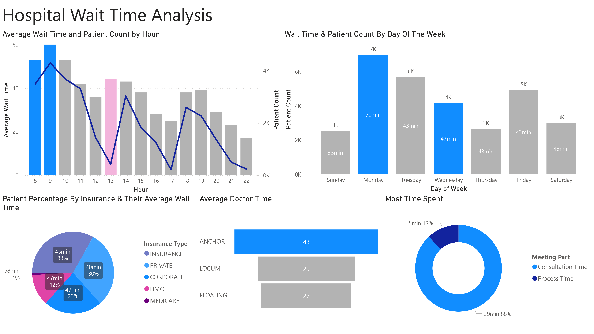
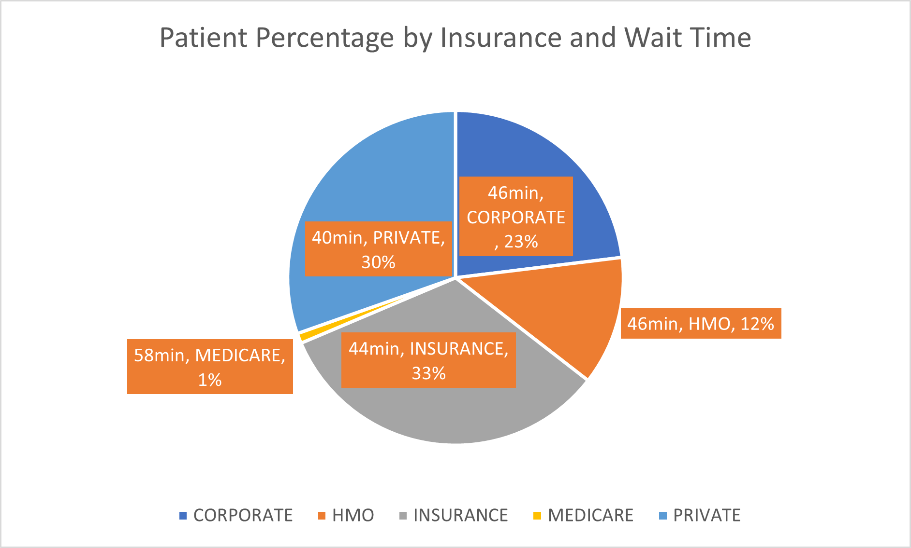
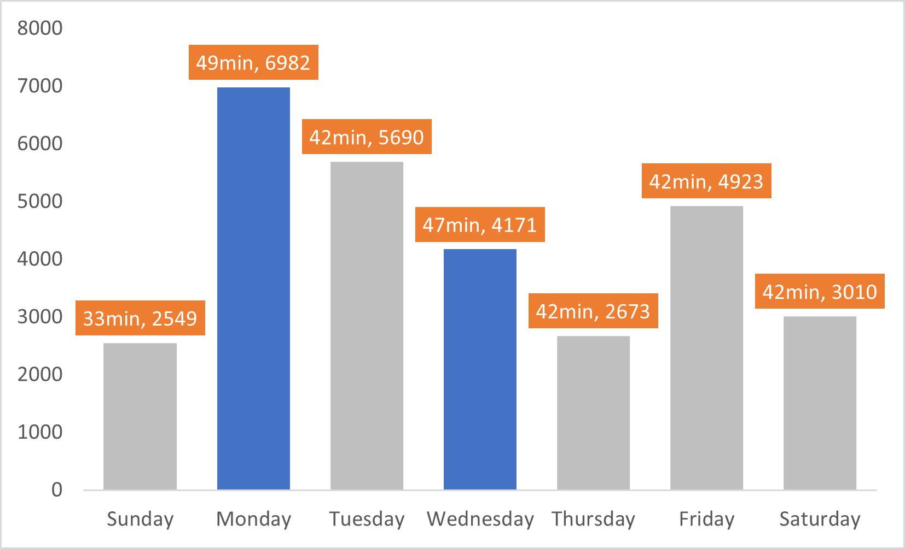
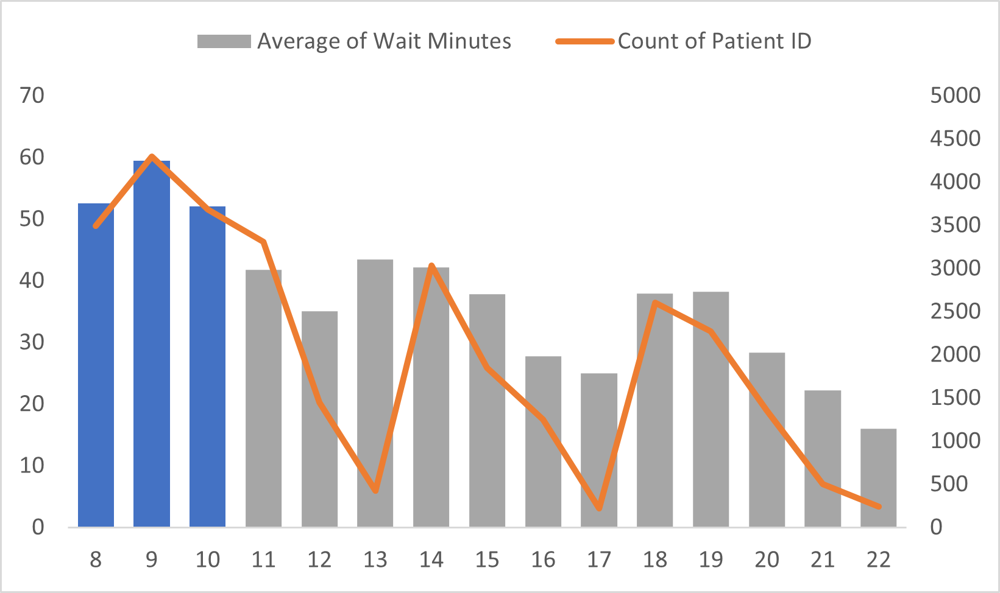
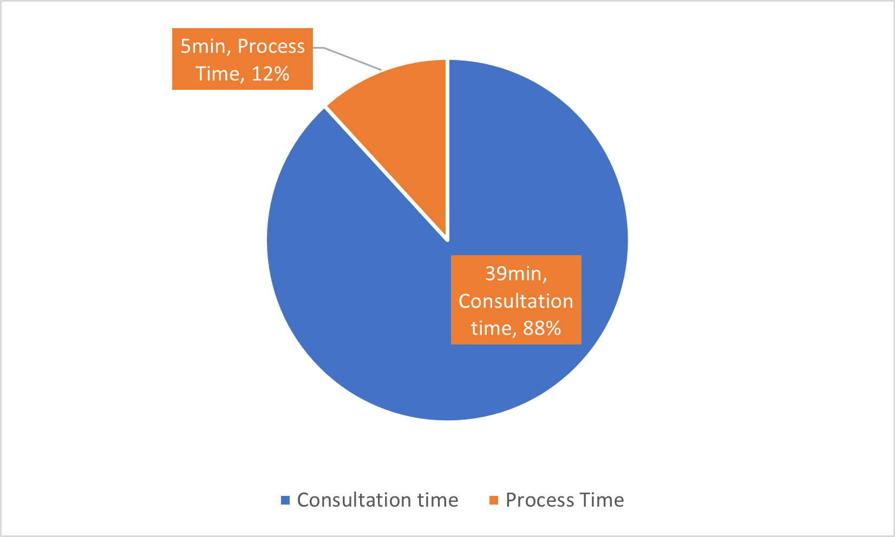
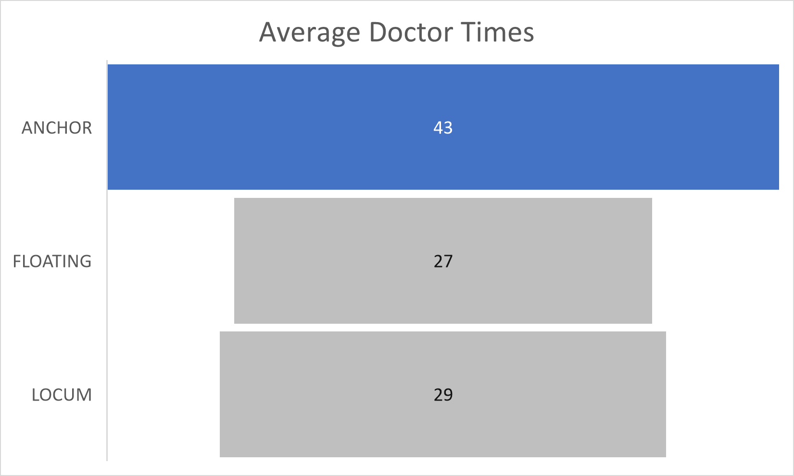

# Hospital wait time Analysis

Efficient management of hospital resources is critical to delivering high-quality patient care. This project analyzes hospital wait times to identify key bottlenecks and propose actionable solutions. The findings can guide staffing and operational adjustments to enhance patient satisfaction and optimize clinic performance.

## Objective
**Addressing Complaints**: Patients have reported excessive wait times at the clinic. This project aims to:

- Investigate the factors contributing to long wait times.
- Develop insights to streamline patient flow and staffing.

## Dashboard

## Key Insights

### Who is waiting the longest?

**Findings:** Insurance type has minimal impact on wait times. However, **Medicare** shows slightly higher average wait times, though the sample size is insufficient for definitive conclusions.

### What days of the week are Affected?

**Findings:** The average wait time is **44 Minutes**.  with the longest delays occurring on **Mondays** and **Wednesdays**.

### Are wait times Associated with Busy Periods?

**Observation:** Wait times are disproportionately high during **lunch hours (around 1 PM)**, despite fewer patients being present. Morning rush hours **(8 AM - 10 AM)** are the busiest, highlighting a need for more staff.

### Staff Allocation Needs

**Findings:** Increasing the number of medical staff during peak morning hours could reduce patient wait times and improve throughput.

### Clinic Duties

**Finding: Anchor doctors** takes significantly more time than other doctors. It is best to not follow that practice during the morning rush.

## Executive Summary

1. Staffing Adjustments:

 - Reallocate or add medical staff during morning rush hours **(8 AM - 10 AM)** to meet patient demand. 
 - Refrain from giving **Dr. Anchor** clinic duty in the morning.
 - Review lunch-hour staffing to ensure adequate coverage.

2. Operational Insights:

 - Conduct a cost-benefit analysis to determine the financial viability of hiring additional staff.
 - Monitor **pre- and post-consultation** times to identify trends and opportunities for further optimization.
